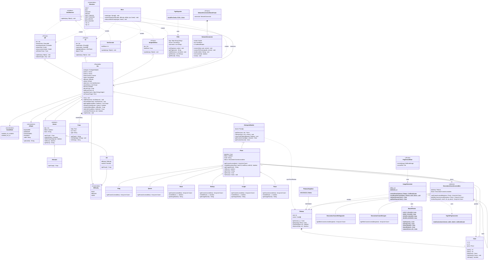

# Class Diagram — Jeu d'Échecs

```mermaid
classDiagram
    %% ─────────────────────────────────────────────
    %% INTERFACES & ENUMS
    %% ─────────────────────────────────────────────
    class JeuObserver {
        <<interface>>
        +update(arg: Object) void
    }

    class GameMode {
        <<enumeration>>
        HUMAN_VS_HUMAN
        HUMAN_VS_AI
    }

    class Difficulty {
        <<enumeration>>
        EASY
        MEDIUM
        HARD
    }

    class AIStyle {
        <<enumeration>>
        EQUILIBRE
        AGRESSIF
        POSITIONNEL
        PRUDENT
        -label: String
        +getLabel() String
    }

    class Direction {
        <<enumeration>>
        HAUT
        BAS
        GAUCHE
        DROITE
        HAUT_DROITE
        HAUT_GAUCHE
        BAS_DROITE
        BAS_GAUCHE
        +dx: int
        +dy: int
    }

    %% ─────────────────────────────────────────────
    %% ENTRY POINT
    %% ─────────────────────────────────────────────
    class Main {
        +main(args: String[]) void
        +restartSameGame(mode, difficulty, aiStyle, jeu, frame) void
        +relaunchWithPrompts(jeu, frame) void
    }

    %% ─────────────────────────────────────────────
    %% MODEL — Core
    %% ─────────────────────────────────────────────
    class Jeu {
        <<Runnable>>
        -echiquier: EchiquierModele
        -joueur1: Joueur
        -joueur2: Joueur
        -joueurCourant: Joueur
        -mode: GameMode
        -difficulty: Difficulty
        -aiStyle: AIStyle
        -observers: List~JeuObserver~
        -moveHistory: List~Coup~
        -termine: boolean
        -dernierCoup: Coup
        -halfmoveClock: int
        -repetitionCounts: Map~String,Integer~
        -enPassantTarget: Point
        +run() void
        +addObserver(o: JeuObserver) void
        +removeObserver(o: JeuObserver) void
        +getLegalMoves(blanc: boolean) List~Coup~
        +isKingInCheck(joueur: Joueur) boolean
        +chooseAiMove(blanc, difficulty) Coup
        +attendreCoup(blanc: boolean) Coup
        +canSelectPiece(row, col) boolean
        +stopGame() void
    }

    class Joueur {
        <<abstract>>
        #jeu: Jeu
        #blanc: boolean
        #nom: String
        +getCoup() Coup*
        +estEnEchec() boolean
        +aDesCoupsLegaux() boolean
        +isBlanc() boolean
        +getNom() String
    }

    class JHumain {
        +getCoup() Coup
    }

    class JIA {
        -difficulty: Difficulty
        -random: Random
        +getCoup() Coup
    }

    class Coup {
        +dep: Point
        +arr: Point
        -type: String
        +getType() String
        +setType(type: String) void
        +toString() String
    }

    %% ─────────────────────────────────────────────
    %% MODEL — Pieces
    %% ─────────────────────────────────────────────
    class Piece {
        #position: Case
        #blanc: boolean
        #color: String
        #decor: DecorateurCasesAccessibles
        +getCasesAccessibles() ArrayList~Case~
        +isValidMove(startRow, startCol, endRow, endCol) boolean
        +getImageName() String
        +isBlanc() boolean
        +getColor() String
        +getCase() Case
        +setCase(c: Case) void
    }

    class King {
        +getCasesAccessibles() ArrayList~Case~
    }

    class Queen {
        +getCasesAccessibles() ArrayList~Case~
    }

    class Rook {
        +getCasesAccessibles() ArrayList~Case~
        +isValidMove(...) boolean
        +getImageName() String
    }

    class Bishop {
        +getCasesAccessibles() ArrayList~Case~
        +isValidMove(...) boolean
        +getImageName() String
    }

    class Knight {
        +getCasesAccessibles() ArrayList~Case~
        +isValidMove(...) boolean
        +getImageName() String
    }

    class Pawn {
        +getCasesAccessibles() ArrayList~Case~
        +isValidMove(...) boolean
        +getImageName() String
    }

    %% ─────────────────────────────────────────────
    %% MODEL — Board
    %% ─────────────────────────────────────────────
    class Plateau {
        -size: int
        -cases: Case[][]
        +getCase(x, y) Case
        +getCase(p: Point) Case
        +canMove(dep, arr) boolean
        +deplacer(dep, arr) boolean
    }

    class PlateauSingleton {
        +INSTANCE: Plateau$
    }

    class Case {
        -x: int
        -y: int
        -piece: Piece
        +getX() int
        +getY() int
        +getPiece() Piece
        +setPiece(p: Piece) void
        +isEmpty() boolean
    }

    class EchiquierModele {
        -board: Piece[][]
        +getPiece(row, col) Piece
        +setPiece(row, col, p: Piece) void
        +syncFromPlateau(plateau: Plateau) void
        +getCouleurCase(ligne, colonne) Color
        +getCouleurSurvol() Color
    }

    class DecorateurCasesAccessibles {
        <<abstract>>
        #plateau: Plateau
        #base: DecorateurCasesAccessibles
        +getCasesAccessibles(piece: Piece) ArrayList~Case~
        #getMesCasesAccessibles(piece: Piece) ArrayList~Case~*
        #collectRay(startX, startY, dx, dy, piece) ArrayList~Case~
    }

    class DecorateurCasesEnDiagonale {
        #getMesCasesAccessibles(piece) ArrayList~Case~
    }

    class DecorateurCasesEnLigne {
        #getMesCasesAccessibles(piece) ArrayList~Case~
    }

    %% ─────────────────────────────────────────────
    %% CONTROLLER
    %% ─────────────────────────────────────────────
    class MF {
        <<JFrame>>
        -jeu: Jeu
        -restartAction: Runnable
        -reconfigureAction: Runnable
        -statusLabel: JLabel
        -announcementLabel: JLabel
        -uiRefreshTimer: Timer
        +update(arg: Object) void
        +attachJeu(jeu: Jeu) void
    }

    class VC {
        <<JFrame>>
        -jeu: Jeu
        -casePanels: JPanel[][]
        -caseLabels: JLabel[][]
        -highlightedMoves: List~Point~
        -depart: Point
        +update(arg: Object) void
    }

    %% ─────────────────────────────────────────────
    %% VIEW
    %% ─────────────────────────────────────────────
    class VueConsole {
        -halfMove: int
        +update(arg: Object) void
    }

    class Simple3DView {
        <<JFrame>>
        -jeu: Jeu
        -lastMove: Coup
        +update(arg: Object) void
    }

    %% ─────────────────────────────────────────────
    %% UTIL
    %% ─────────────────────────────────────────────
    class ImageGenerator {
        -CELL: int$
        -MARGIN: int$
        +renderBoard(plateau: Plateau) BufferedImage$
        +saveBoardAsPng(plateau: Plateau, path: String) void$
        +getLightSquareColor() Color$
        +getDarkSquareColor() Color$
    }

    class BoardTheme {
        -LIGHT_SQUARE: Color$
        -DARK_SQUARE: Color$
        -HOVER_SQUARE: Color$
        -BOARD_BORDER: Color$
        +lightSquare() Color$
        +darkSquare() Color$
        +hoverSquare() Color$
        +boardBorder() Color$
        +squareAt(row, col) Color$
    }

    %% ─────────────────────────────────────────────
    %% TOOLS
    %% ─────────────────────────────────────────────
    class SvgToPngConverter {
        +loadSvgAsImage(stream, width, height) BufferedImage$
    }

    class PGN {
        -tags: Map~String,String~
        -moves: List~String~
        -comments: List~String~
        +setTag(name, value) void
        +getTag(name) String
        +addMove(san, comment) void
        +getMoves() List~String~
        +getResult() String
    }

    class PgnExporter {
        +buildPgnText(p: PGN) String$
    }

    class NetworkConnector {
        -socket: Socket
        -out: PrintWriter
        -in: BufferedReader
        +connect(host, port, onLine) void
        +connectToProcess(path, onLine) void
        +sendLine(line: String) void
        +isConnected() boolean
        +close() void
    }

    class NetworkConnectorDemoFrame {
        <<JFrame>>
        -connector: NetworkConnector
    }

    %% ─────────────────────────────────────────────
    %% EDITOR
    %% ─────────────────────────────────────────────
    class PngChessEditor {
        <<JFrame>>
        -currentImage: BufferedImage
        -currentFile: File
    }

    %% ─────────────────────────────────────────────
    %% RELATIONSHIPS
    %% ─────────────────────────────────────────────

    %% Inheritance — Players
    Joueur <|-- JHumain
    Joueur <|-- JIA

    %% Inheritance — Pieces
    Piece <|-- King
    Piece <|-- Queen
    Piece <|-- Rook
    Piece <|-- Bishop
    Piece <|-- Knight
    Piece <|-- Pawn

    %% Inheritance — Decorators
    DecorateurCasesAccessibles <|-- DecorateurCasesEnDiagonale
    DecorateurCasesAccessibles <|-- DecorateurCasesEnLigne

    %% Observer pattern
    JeuObserver <|.. MF
    JeuObserver <|.. VC
    JeuObserver <|.. VueConsole
    JeuObserver <|.. Simple3DView

    %% Jeu enums (inner)
    Jeu --> GameMode
    Jeu --> Difficulty
    Jeu --> AIStyle

    %% Jeu associations
    Jeu "1" o-- "1" EchiquierModele
    Jeu "1" o-- "2" Joueur
    Jeu "1" *-- "*" Coup : moveHistory
    Jeu "1" o-- "*" JeuObserver : observers

    %% Joueur association
    Joueur --> Jeu
    JIA --> Difficulty

    %% Board associations
    Plateau "1" *-- "64" Case
    EchiquierModele "1" o-- "*" Piece
    EchiquierModele ..> Plateau : syncFromPlateau
    PlateauSingleton --> Plateau : INSTANCE
    Case "1" o-- "0..1" Piece

    %% Piece associations
    Piece --> Case : position
    Piece --> DecorateurCasesAccessibles : decor
    DecorateurCasesAccessibles --> Plateau
    DecorateurCasesAccessibles --> DecorateurCasesAccessibles : base

    %% Controller associations
    MF "1" o-- "1" Jeu
    VC "1" o-- "1" Jeu
    Simple3DView "1" o-- "1" Jeu

    %% Util / Tools usage
    ImageGenerator ..> Plateau : renders
    ImageGenerator ..> BoardTheme : uses
    ImageGenerator ..> SvgToPngConverter : uses
    PgnExporter ..> PGN : uses
    NetworkConnectorDemoFrame "1" *-- "1" NetworkConnector
    PngChessEditor ..> ImageGenerator : uses

    %% Entry point
    Main ..> Jeu : creates
    Main ..> MF : creates
    Main ..> VC : creates
    Main ..> VueConsole : creates
    Main ..> Simple3DView : creates
```

